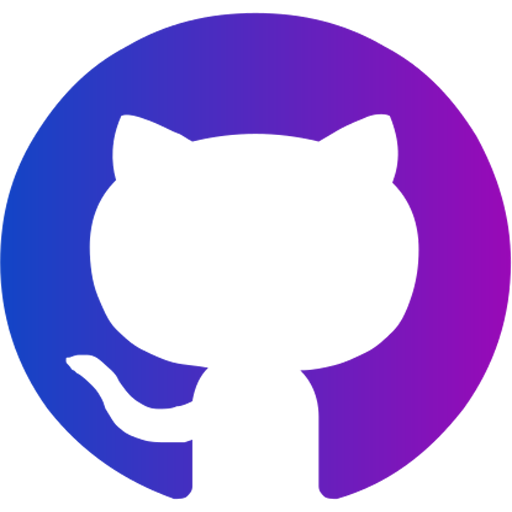

_"Simplicity is the ultimate sophistication" (Da Vinci)_&nbsp;&nbsp;&nbsp;&nbsp;&nbsp;&nbsp;|&nbsp;&nbsp;&nbsp;&nbsp;&nbsp;&nbsp;**[ OPEN ME ONLINE ➜ ](https://bertz.tech/)**

  

<table><tr><td>
  
 

<b>DIGIΓΔL / IT ROMA</b> BERTZ.WORKS / SHAPE DIGITAL GROUP<b> 
👋 Hello World! I’m Alberto Marà, aka @bertz-tech </b>
 
  <code>"An ex creativedirector passed to darkside of force... the coding."</code>
 
56K Generation. I'm started with tapes in commodore 64 (floppies was rare), now I  make modern designs and software structures, line by line and code by code. 

 

&nbsp;

<!--
&nbsp;

&nbsp;

-->
&nbsp;

&nbsp;

</td></tr></table>
  

  
## <b>🚀🧠 systems, tools and technologies</b>

| |&nbsp;&nbsp;&nbsp; | 
|:---:|:---:|

### Open Projects:
<a href="https://github.com/wordpress-projects-station" target="_blank">
    
    <b>wordpress project station</b> 
    An open collection of resources and extensions for wordpress
</a>  
<a href="https://github.com/ShapeGroup/kimera-frontend-framework" target="_blank">
    
    <b>kimera frontend framework</b> 
    An open ui web framework of web 2.0 
</a>

<!--
info:
💬
find emoji:  https://emojipedia.org/emoji/
find me on google: https://www.google.com/search?client=firefox-b-d&q=addme+to+search
How to badge: https://shields.io/category/build
All icons: https://simpleicons.org/
custom stats:
  on https://github.com/anuraghazra/github-readme-stats +++ &hide=html&hide_border=false&card_width=320&layout=compact&text_color=dimgray&title_color=cyan&icon_color=aqua&bg_color=WhiteSmok
  
  src="https://github-readme-stats.vercel.app/api/wakatime?username=ebfeebe0-ae51-4c38-8521-9b0bf9402c6e&langs_count=7&custom_title=Runtime&nbsp;Stats&hide_border=false&titletext_color=dimgray&title_color=cyan&icon_color=aqua&bg_color=WhiteSmok"

https://bertz-tech.github.io/
https://bertz.tech/

-->
